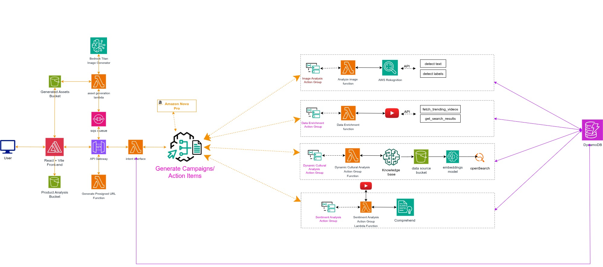

# StrategIQ Marketing Campaign Generator

> **AI-driven, serverless pipeline that converts product images into fully enriched, trend-informed marketing campaigns using AWS, YouTube Data API, and Amazon Bedrock.**

[](https://www.terraform.io/)
[](https://aws.amazon.com/)
[](https://www.python.org/)
[](https://docs.aws.amazon.com/eventbridge/)
[](https://developers.google.com/youtube/v3)
[](https://aws.amazon.com/bedrock/)

---

## Project Overview

This project implements an automated, event-driven marketing campaign generation system. It ingests product images, extracts rich visual and contextual attributes, enriches them with real-time Social Media trend intelligence, and generates multi-channel marketing campaign assets using generative AI models hosted on Amazon Bedrock.

**Core Value Proposition**:
- Eliminate manual research steps
- Accelerate creative generation
- Leverage current audience engagement signals
- Produce consistent, data-backed campaign strategies

---

## System Architecture

A two-phase, fully serverless architecture orchestrated via Amazon EventBridge Pipes:



### Processing Flow

1. Image + metadata uploaded to Amazon S3
2. S3 event triggers Image Analysis Lambda (Rekognition + OCR)
3. Results persisted to DynamoDB (Primary Analysis Table)
4. DynamoDB stream → EventBridge Pipe (filtering only completed analyses)
5. Enrichment Lambda queries YouTube Data API (trend + engagement context)
6. Enriched record stored in secondary DynamoDB table
7. Campaign Generator Lambda builds structured Bedrock prompts
8. Generated multi-format campaign artifacts stored and surfaced via API

### Technology Stack

| Component                | Technology / Service                               | Docs / Section                                  |
| ------------------------ | --------------------------------------------------- | ------------------------------------------------ |
| Image Analysis           | AWS Lambda (Python 3.11) + Amazon Rekognition       | [Image Analysis](#image-analysis)               |
| Trend Enrichment         | AWS Lambda + YouTube Data API v3                   | [Trend Enrichment](#trend-enrichment)           |
| Campaign Generation      | AWS Lambda + Amazon Bedrock (Nova / foundation)    | [Campaign Generation](#campaign-generation)     |
| Orchestration            | EventBridge Pipes + DynamoDB Streams               | [Event Orchestration](#event-orchestration)     |
| Data Storage             | Amazon DynamoDB (2 tables) + S3 object storage     | [Data Model](#data-model)                       |
| API Layer                | Amazon API Gateway (REST)                          | [API Reference](#api-reference)                 |
| Infrastructure as Code   | Terraform                                           | [Infrastructure](#infrastructureterraform)      |
| Observability            | CloudWatch Logs / Metrics / Dashboards             | [Monitoring](#monitoring--operations)           |

### Quick Start Navigation

Choose where you want to contribute or explore:

- [Image Analysis Pipeline](#image-analysis)
- [Trend Enrichment Service](#trend-enrichment)
- [Campaign Generation (AI)](#campaign-generation)
- [Infrastructure / Terraform](#infrastructureterraform)
- [Testing & Monitoring](#testing--monitoring)

---

## Image Analysis

### Overview
Performs initial extraction of visual and contextual product attributes using Amazon Rekognition (labels, moderation, text) and computes a deterministic image hash for correlation.

### Responsibilities
- Label + category inference
- Text/OCR extraction (if present)
- Content safety / moderation flags
- Attribute confidence scoring
- Status persistence to DynamoDB (Analysis Table)

### Trigger & Event Shape
- Source: S3 ObjectCreated event
- Output: Normalized record written to DynamoDB with fields: `image_hash`, `labels[]`, `text[]`, `moderation_flags[]`, `categories[]`, `status`.

### Key File(s)
- `scripts/analyse_image_lambda.py` (or Lambda source directory if refactored into `lambda/` subfolder)

### Potential Enhancements
- Multi-language text normalization
- Embeddings generation for semantic clustering
- Duplicate detection via perceptual hashing

---

## Trend Enrichment

### Overview
Consumes filtered DynamoDB stream events (only completed analyses) via EventBridge Pipes and enriches records with live YouTube trend insights.

### Responsibilities
- Intelligent query construction from product attributes
- YouTube Data API v3 search + statistics retrieval
- Engagement signal extraction (views, likes, comments ratios)
- Topic + audience intent inference
- Writes enriched payload to Enrichment Table (DynamoDB)

### Key File(s)
- `scripts/enrichment_lambda.py`

### Advanced Features
- Confidence-weighted keyword ranking
- Query diversification to avoid quota inefficiencies
- Graceful degradation on partial API failures

---

## Campaign Generation

### Overview
Generates structured, multi-channel marketing deliverables (social copy, positioning statements, audience personas, taglines) using Amazon Bedrock models.

### Responsibilities
- Aggregates base + enrichment data
- Builds context-rich prompts (product + trends + audience)
- Invokes Bedrock model (Nova Pro or alternative)
- Structures output into JSON campaign blueprint
- Persists final campaign artifact bundle

### Key File(s)
- `scripts/campaign_generator_lambda.py`

### Output Artifacts (Typical)
- `campaign.strategy_summary`
- `campaign.personas[]`
- `campaign.social_posts[]`
- `campaign.key_messages[]`
- `campaign.content_calendar`

### Future Opportunities
- A/B variant generation
- Tone + brand voice conditioning
- Channel performance prediction

---

## Event Orchestration

### Core Pattern
DynamoDB Streams → EventBridge Pipe (filter + transform) → Target Lambda. This ensures minimal custom glue code and native retry / DLQ support.

### Benefits
- Fine-grained event filtering (only completed analysis states)
- Reduced Lambda cold start pressure
- Centralized error handling
- Natural backpressure through stream sequencing

---

## Data Model

| Table / Store        | Purpose                               | Key(s) / Indexes                         |
| -------------------- | -------------------------------------- | ---------------------------------------- |
| Analysis Table       | Raw + processed visual analysis        | PK: `image_hash`                         |
| Enrichment Table     | Trend + engagement metadata            | PK: `image_hash`                         |
| Campaign Output (opt)| Final campaign asset bundle            | PK: `image_hash` (or composite if needed) |
| S3 (images)          | Original product images                | Object key (namespaced by upload)        |

Optional secondary indexes can support querying by category or campaign status.

---

## Infrastructure/Terraform

### Overview
All AWS resources are provisioned using Terraform. Recommended layout leverages environment-specific workspaces / `tfvars` to isolate deployments.

### Core Resources
- S3 bucket (image ingress + static hosting if required)
- DynamoDB tables (analysis + enrichment)
- Lambda functions (analysis, enrichment, generator)
- EventBridge Pipe + IAM roles
- API Gateway (presigned URL + status endpoints)
- CloudWatch dashboards / alarms (optional)

### Prerequisites
- AWS Account & credentials (`aws configure`)
- Terraform ≥ 1.5
- Python 3.11 runtime for Lambdas
- YouTube Data API key
- Bedrock model access approved in selected region

### Environment Variables / Secrets
Add to Parameter Store / Secrets Manager or export prior to `terraform apply`:

```bash
export YOUTUBE_API_KEY=your_youtube_api_key
export AWS_REGION=eu-west-1
export PROJECT_NAME=yt-campaign-gen
export ENVIRONMENT=dev
```

### Deployment Steps (Baseline)
```bash
git clone https://github.com/Amali-Tech/degenerals-infra.git
cd degenerals-infra/terraform
cp terraform.tfbackend.example terraform.tfbackend   # configure remote state
terraform init
terraform plan
terraform apply -auto-approve
```

Capture the output values for API endpoints and resource ARNs.

---

## API Reference

| Method | Endpoint                  | Description                | Auth    |
| ------ | ------------------------- | -------------------------- | ------- |
| POST   | `/presigned-url`          | Generate signed S3 upload  | API Key |
| GET    | `/status/{imageHash}`     | Retrieve pipeline status   | API Key |

### Example: Generate Upload URL
```bash
curl -X POST "$API_BASE/presigned-url" \
  -H 'Content-Type: application/json' \
  -H 'x-api-key: YOUR_KEY' \
  -d '{"filename":"test.jpg","filetype":"image/jpeg"}'
```

### Example: Poll Status
```bash
curl -H 'x-api-key: YOUR_KEY' "$API_BASE/status/<imageHash>"
```

### Sample Status Response
```json
{
  "status": "completed",
  "pipeline_stage": "campaign_generated",
  "results": {
    "analysis": {"labels": []},
    "enrichment": {"trends": []},
    "campaigns": {"strategy_summary": "..."}
  }
}
```

---

## Testing & Monitoring

### Quick End-to-End Test
1. Request presigned URL
2. Upload sample product image
3. Watch DynamoDB stream activity & Lambda logs
4. Query status endpoint until `campaign_generated`

### Key CloudWatch Metrics
- Lambda: Invocations / Errors / Duration / Throttles
- DynamoDB: RCUs / WCUs / ThrottledRequests
- EventBridge: Pipe delivery failures
- API Gateway: 4XX / 5XX error counts

### Logging Strategy
- Structured JSON logs with correlation id (image hash)
- Severity segmentation (INFO, WARN, ERROR)
- Retry + DLQ visibility via EventBridge metrics

---

## Performance Benchmarks (Typical)

| Stage               | Latency (avg) | Notes                                |
| ------------------- | ------------- | ------------------------------------ |
| Image Analysis       | 5–15s         | Dependent on Rekognition label set   |
| YouTube Enrichment   | 2–5s          | API latency + query diversification  |
| Campaign Generation  | 10–30s        | Model + prompt complexity            |
| End-to-End Pipeline  | 20–60s        | Aggregate                           |

Optimization levers: batching queries, prompt token reduction, concurrency tuning.

---

## Security

### Core Controls
- IAM least-privilege roles per Lambda
- API Key (baseline) – recommend upgrade to Cognito/OAuth for production
- Encrypted at rest (S3 SSE, DynamoDB default encryption)
- TLS enforced via API Gateway & presigned URL policies
- Parameter Store / Secrets Manager for sensitive values

### Hardening Opportunities
- WAF in front of API Gateway
- Structured PII classification (if adding user data)
- Quota guards for external API usage

---

## Troubleshooting

| Symptom                               | Likely Cause                               | Action |
| ------------------------------------- | ------------------------------------------- | ------ |
| Missing enrichment data               | Filter rejected event                       | Verify DynamoDB item status field |
| YouTube quota exceeded                | Excessive search permutations               | Introduce caching / backoff       |
| Bedrock access denied                 | Region/model permissions not enabled       | Enable model access in console    |
| Lambda timeout (campaign generation)  | Large prompt / slow model                   | Increase timeout & optimize prompt|
| Event not reaching enrichment Lambda  | Pipe filter mismatch                        | Inspect EventBridge pipe criteria |

### Diagnostic Commands
```bash
aws logs tail /aws/lambda/<analysis-fn> --follow
aws logs tail /aws/lambda/<enrichment-fn> --follow
aws logs tail /aws/lambda/<campaign-fn> --follow
aws dynamodb get-item --table-name <AnalysisTable> --key '{"image_hash":{"S":"<hash>"}}'
```

---

## Roadmap

### Near-Term
- Structured prompt templates versioning
- Retry abstraction + DLQ compaction tooling
- Partial failure surfacing in status API

### Mid-Term
- Multi-platform trend sources (TikTok, Instagram)
- Content performance feedback loop
- Automated variant testing harness

### Long-Term
- Predictive conversion scoring
- Multi-tenant workspace segmentation
- Fine-tuned domain-specific generation models

---

## Contributing

### Workflow
1. Create feature branch: `git checkout -b feature/<name>`
2. Implement changes with tests
3. Run lint / formatting (add scripts if missing)
4. Validate Terraform plan in sandbox
5. Submit PR with concise description and impact notes

### Guidelines
- Prefer idempotent, stateless Lambda design
- Use environment variables over inline constants
- Keep prompts modular & parameterized
- Log structured JSON (avoid free-form strings)
- Document new Terraform modules with input/output blocks

---

## Support

| Channel            | Purpose                      |
| ------------------ | ---------------------------- |
| GitHub Issues       | Bugs / feature requests      |
| Slack (#ai-hackathon-support) | Internal coordination |
| Email               | Direct escalations           |

### Useful References
- [AWS Lambda Best Practices](https://docs.aws.amazon.com/lambda/latest/dg/best-practices.html)
- [YouTube Data API](https://developers.google.com/youtube/v3)
- [Amazon Bedrock Docs](https://docs.aws.amazon.com/bedrock/)
- [EventBridge Pipes](https://docs.aws.amazon.com/eventbridge/latest/userguide/eb-pipes.html)

---

**Built with ⚡ serverless + AI to accelerate marketing creativity.**

_Last Updated: October 20, 2025_
